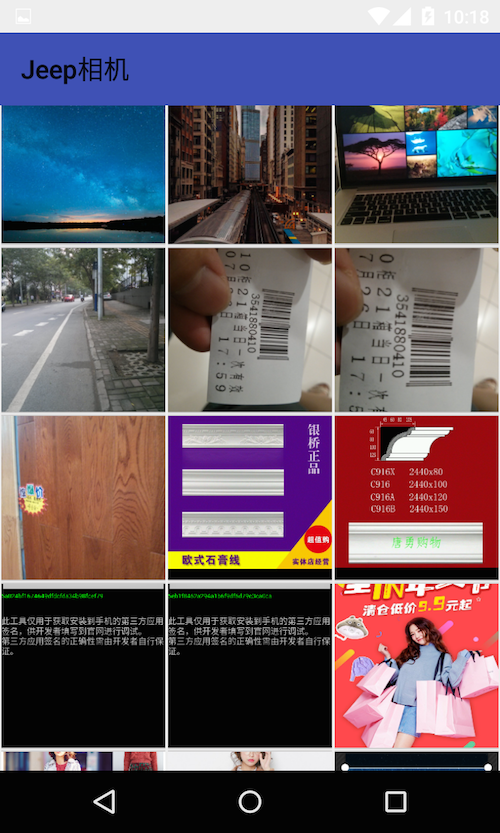

# JeepCamera
===

android library for take a photograph or choose a picture.

#### preview




#### how to install

```
	// gradle :
	
	compile('cn.jerry.android:jeepcamera:${lastVersion}@aar')
	
	
	// maven :
	<dependency>
		<groupId>cn.jerry.android</groupId>
		<artifactId>jeepcamera</artifactId>
		<version>${lastVersion}</version>
		<type>jar</type>
		<classifier>javadoc</classifier>
	</dependency>
```

#### how to use

```

    // isSelect   if true : choose a picture in gallery. else take a new photo ...
    BasePhotoActivity.tackPhoto(context, isSelect);

    @Override protected void onActivityResult(int requestCode, int resultCode, Intent data) {
      if (resultCode == Activity.RESULT_CANCELED) {
        return;
      }
  
      Uri uri = data.getData();
      switch (requestCode) {
        case BasePhotoActivity.REQUEST_CODE_SELECT:
          //upload(uri);
          Log.e("URL", uri.toString());
          break;
  
        case BasePhotoActivity.REQUEST_CODE_PHOTO:
          //upload(uri);
          Log.e("URL", uri.toString());
          break;
  
        default:
          break;
      }
    }
    
    public void uploadPic(Uri uri) {
      // TODO upload your image here
      ImageView imageView = (ImageView) findViewById(R.id.imageView);
            imageView.setImageURI(uri);
    }
```